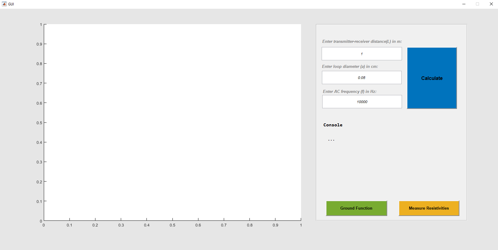
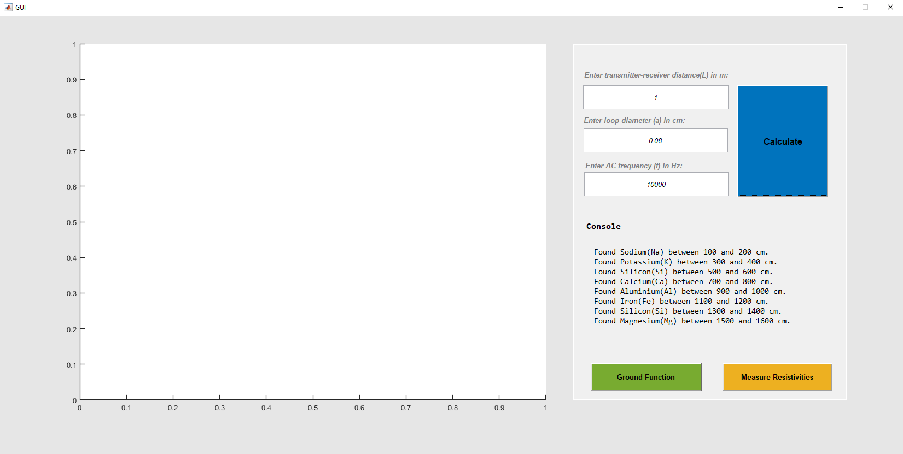
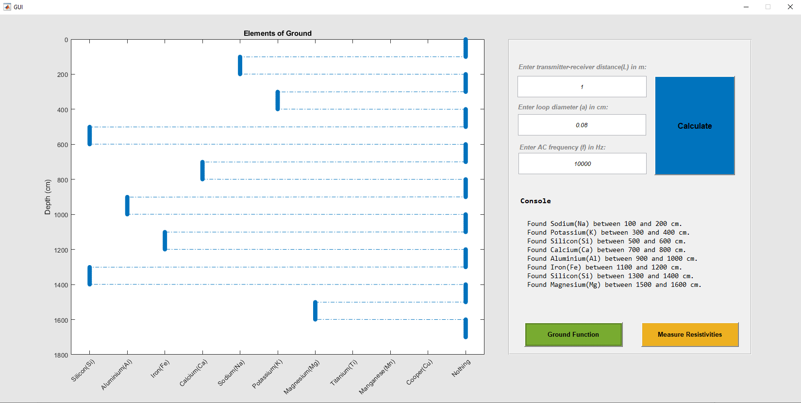
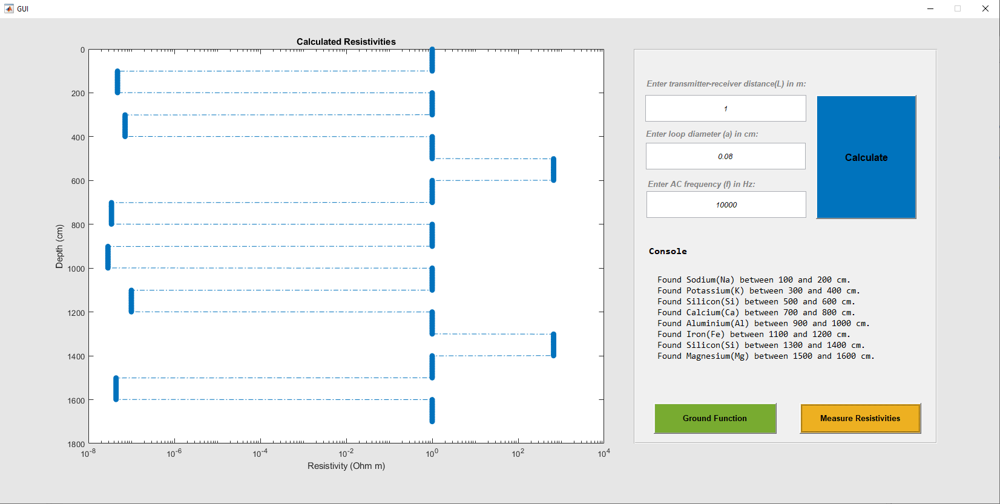

# Geophysics

This repository contains the assignments for the Academic Courses "Geo-electromagnetism" taught in the Fall of 2020-2021 in Aristotle University of Thessaloniki - Electrical and Computer Engineering Department.

The purpose of this project is the familiarization with the **Conductive Method**, through the implementation of a MATLAB software that simulates a vertical drilling of various ground layers. The results are illustrated via a **GUI**, developed with MATLAB GUIDE toolbox.

### Simulation

The experiment consist of a transmitter and a receiver. The transmitter is responsible to produce an AC current of certain frequency and the receiver, to measure an electrical signal. Via this measurement we can calculate the resistivity and conductivity of the corresponding layer. With the help of those values we next search in a database, in order to find the real value that is closest to our calculation. This value corresponds to an **element**, which is then predicted for the current layer.

### GUI

A friendly-to-user GUI appears, when the program is executed. Through this GUI, user can enter the following parameters of the simulation:

- **L**: is the distance between transmitter and receiver in m (*default = 1 m*)

- **a**: is the diameter of the current loop inside the mechanism in cm (*default = 0.08 cm*)

- **f**: is the frequency of the AC current produced by transmitter in Hz (*default = 10 kHz*)

  

    

The experiment is simulated via the *Calculate* button. The results are printed in a *Console*:

    

With the button *Ground Function* the user can illustrate the real ground *elements* with respect to *Depth*, while with the button *Measure Resistivities* the measured resistivities with respect to *Depth* are plotted:

    

    

